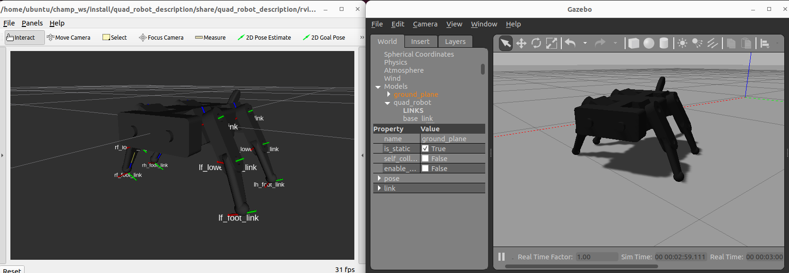

# quad_robot

This is the ROS 2 package for quad_robot simulation.



## Supported ROS 2 distributions

[![humble][humble-badge]][humble]
[![ubuntu22][ubuntu22-badge]][ubuntu22]

## Build
```shell: Terminal
cd ~/dev_ws
colcon build --packages-select quad_robot
```

## Usage

- bringup Rviz2

```sh
cd ~/champ_ws/
. install/setup.bash
ros2 launch quad_robot_bringup bringup.launch.py
```

- Gazebo Simulation

```sh
cd ~/champ_ws/
. install/setup.bash
ros2 launch quad_robot_gazebo display_ros2_control.launch.py
```

```sh
cd ~/champ_ws/
. install/setup.bash
ros2 run quad_robot_gazebo quadruped_effort
ros2 run quad_robot_gazebo quadruped_effort_init
```

## Modified tips

### quad_robot.xacro
```xml: quad_robot.xacro
<!-- TODO effort controller なら滑らずにモデルを使用できる -->
<xacro:include filename="$(find quad_robot_description)/ros2_control/quad_robot_ros2_effort_control.xacro" />
<xacro:quad_robot_ros2_control name="quad_robot" />
```
effort controllerならOK、position_controllerは×

### quad_robot_description.xacro
```xml: quad_robot_description.xacro
<!-- TODO add joint tag to <dynamics damping="0.0" friction="10.0"/> -->
<joint name="lh_lower_leg_joint" type="revolute">
  <origin xyz="0.0 0.006 -0.1" rpy="0 0 0"/>
  <parent link="lh_upper_leg_link"/>
  <child link="lh_lower_leg_link"/>
  <axis xyz="-0.0 1.0 0.0"/>
  <limit upper="1.047198" lower="-1.047198" effort="100" velocity="10"/>
  <dynamics damping="0.0" friction="10.0"/>
</joint>
```
dynamics damping, frictionを追加する

### quad_robot.gazebo
```xml: quad_robot.gazebo
<gazebo reference="rf_lower_leg_link">
  <material>${body_color}</material>
  <!-- mu上げると滑る、下げると止まる -->
  <!-- kp上げると滑る -->
  <!-- kd上げると地面に練り込む -->
  <!-- mindepth 上げると沈む -->
  <kp>1e5</kp>
  <kd>100</kd>
  <mu1>0.8</mu1>
  <mu2>0.8</mu2>
  <fdir1>1 0 0</fdir1>
  <maxVel>0.1</maxVel>
  <minDepth>0.001</minDepth>
</gazebo>
```
コメントは所感、足先以外は基本kp, kdなどのパラメータは追加しないこと

### ros2_control/quad_robot_ros2_effort_control.xacro

effortコントローラー用に<command_interface name="effort">とする

### config/quad_robot_effort_controller.yaml

```yaml
    command_interfaces:
      - effort
    state_interfaces:
      - position
      - velocity

    gains:
      lf_hip_joint        : {p: 50.0, i: 0.2, d: 1.0, i_clamp: 2.5}
      lf_upper_leg_joint  : {p: 50.0, i: 0.2, d: 1.0, i_clamp: 2.5}
      lf_lower_leg_joint  : {p: 50.0, i: 0.2, d: 1.0, i_clamp: 2.5}
      rf_hip_joint        : {p: 50.0, i: 0.2, d: 1.0, i_clamp: 2.5}
      rf_upper_leg_joint  : {p: 50.0, i: 0.2, d: 1.0, i_clamp: 2.5}
      rf_lower_leg_joint  : {p: 50.0, i: 0.2, d: 1.0, i_clamp: 2.5}
      lh_hip_joint        : {p: 50.0, i: 0.2, d: 1.0, i_clamp: 2.5}
      lh_upper_leg_joint  : {p: 50.0, i: 0.2, d: 1.0, i_clamp: 2.5}
      lh_lower_leg_joint  : {p: 50.0, i: 0.2, d: 1.0, i_clamp: 2.5}
      rh_hip_joint        : {p: 50.0, i: 0.2, d: 1.0, i_clamp: 2.5}
      rh_upper_leg_joint  : {p: 50.0, i: 0.2, d: 1.0, i_clamp: 2.5}
      rh_lower_leg_joint  : {p: 50.0, i: 0.2, d: 1.0, i_clamp: 2.5}
```

ros controller用に設定する。場合によってpidゲインを調整すること
pidゲイン調整がほぼすべて

マンタみたいなやつはbody, head のmass=0にして、足のend massを大きくしている

## Get and Play Gazebo log

- Logging from the GUI

hit 'Ctrl+D' to bring up the Data Logger.

- Play back a log file
```sh
gazebo -u -p ~/logs/double_pendulum/2016-01-25T15\:09\:49.677400/gzserver/state.log
```

[Logging and playback](https://classic.gazebosim.org/tutorials?tut=logging_playback)

## License
This repository is licensed under the Apache License license, see LICENSE.

[humble-badge]: https://img.shields.io/badge/-HUMBLE-orange?style=flat-square&logo=ros
[humble]: https://docs.ros.org/en/humble/index.html

[ubuntu22-badge]: https://img.shields.io/badge/-UBUNTU%2022%2E04-blue?style=flat-square&logo=ubuntu&logoColor=white
[ubuntu22]: https://releases.ubuntu.com/jammy/
